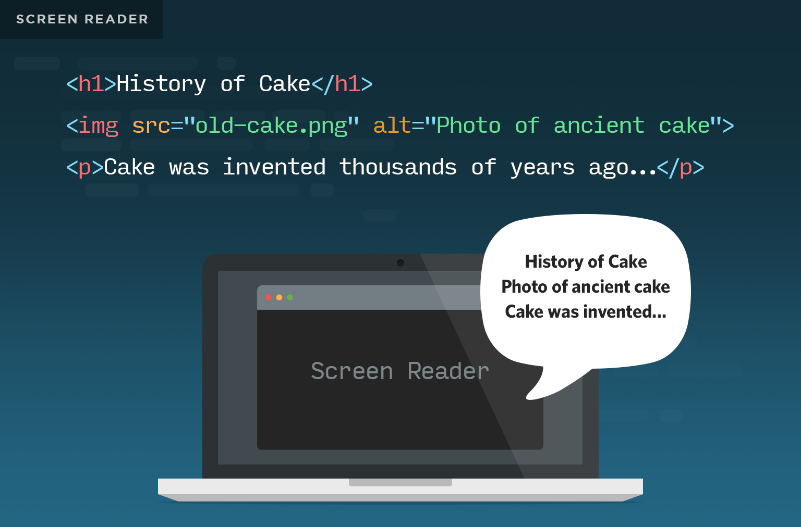
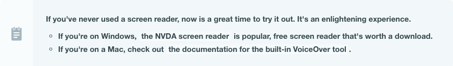
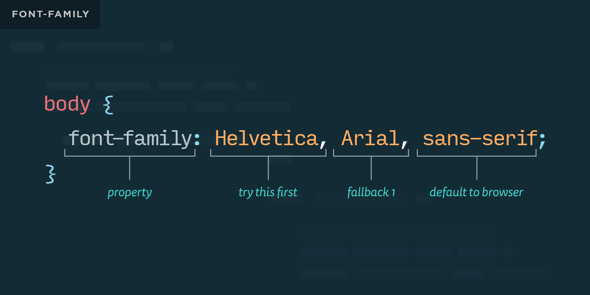
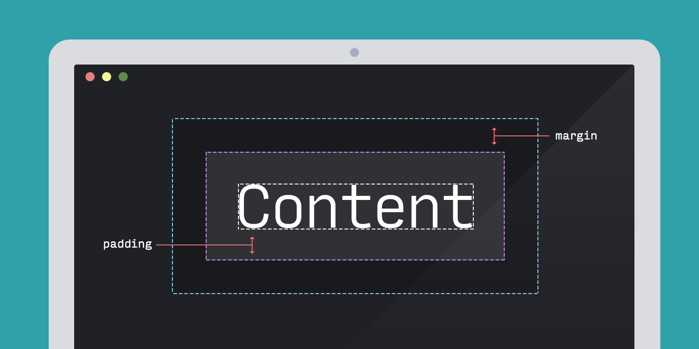
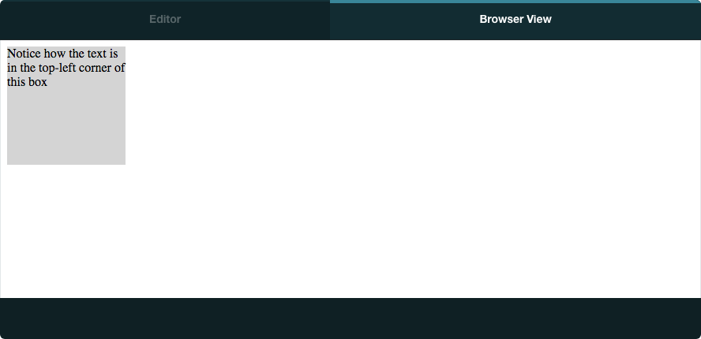
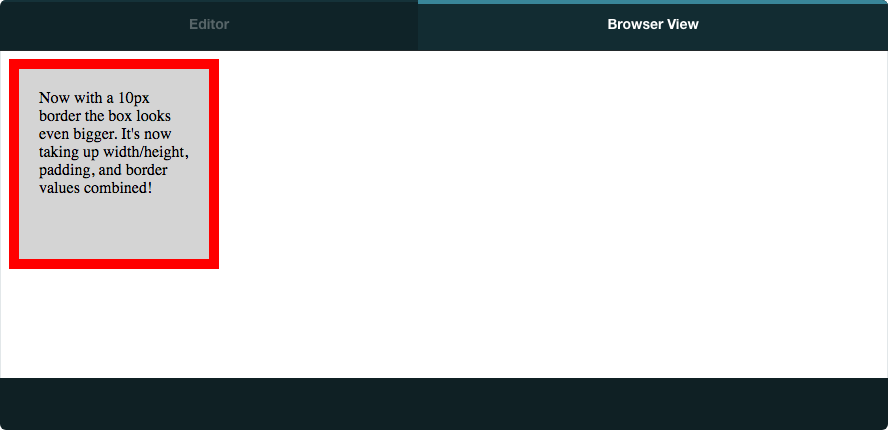

Today's class will focus on the CSS "Box Model" and typography, as well as revisit a few HTML attributes that can have a big impact on accessibility.

## Today's Learning Objectives

Today we'll cover these **learning objectives**. By the end of today, you'll be able to

* *explain why coding for accessibility is important*
* *identify common accessibility strategies when producing HTML pages*
* *use child selectors for targeted styling of sequential content*
* *apply font styles to elements such as size, color, family, style, and decoration*
* *explain the box model and how height, width, border, margin, and padding effect it*
* *calculate “total” dimensions of an HTML element using the standard box model*

As you attend the lecture and lab, read these notes, and work on your homework, keep these learning objectives top of mind. If you're having difficulty with any of the objectives, make sure to ask questions!

## HTML Accessibility

Learning to create accessible web pages is a big topic, and in this course we'll only scratch the surface. However, a little bit of effort can go a really long way. For example, in the previous lesson we briefly mentioned that semantic HTML can dramatically improve the experience for people using assistive technology, such as screen readers.

A similar "small" change with a big impact is learning to use the `alt` and `title` HTML attributes properly.

### The 'alt' Attribute

The `alt` attribute is often misunderstood, but the concept is simple: it provides **alternate** text describing an image when that image cannot be displayed. One of the most common use cases is **screen readers**.

Because a screen reader application has no reasonable way to analyze and describe the contents of an image, you as the author of the content can provide a short, helpful description.
```

```


Here are a few helpful hints:

* Every image should have `alt` attributes
* Images that are purely decorative should have a blank value: `alt=""` (this is fairly rare, as most images of this nature are CSS backgrounds)
* Avoid redundant phrases like "An image of...". It's implied that an image is being described. Specifying a kind of image may make sense, however: "An illustration of..", "A diagram of...", "A photograph of..."



### The 'title' attribute

While you may find examples of elements with identical values for `alt` and `title` attributes, they're not the same. `title` values will *not* be read by screen readers, and instead provide **tooltips** that display when the mouse is over the element. This isn't restricted to `img` elements. Such tooltips can be added to paragraphs, quotations, links, and more.

Do not rely on the title attribute for accessibility. Some screen readers don't support the title attribute and those that do, don't read the title attribute by default. It requires changing a setting for the title to be read, which not all users do.

Note: Use of the title attribute is highly problematic for many users:

* Mobile users
* Users with screen readers
* Users navigating with keyboards

The `title` attribute can be useful, but it shouldn't be relied on as the only way to relay certain information to the user.

## CSS Typography Basics

As web typography has become more refined over the last few years, it's grown increasingly easy to add beautiful typographic styles. Even with these refinements, there are still a few workhorse CSS properties you'll want to master early on:

* `font-size` is used to change the size of text in an element. It expects a numeric value along with a unit (`px`, `em`, `rem`)
* `text-transform` is a great way to change the capitalization. Values include `capitalize`, `lowercase`, `uppercase`, and `initial`
* `text-decoration` is primarily used with the `underline` and `line-through` values to create underlined and "strike through" effects
* `font-style` is almost always to italicize text
* `font-family` expects a list of fonts to "try" from left to right. More on this below.
* `line-height` defines the space above and below a line of text. It expects a numeric value along with a unit of measurement using `px`, `em`, `rem`, etc.
* `letter-spacing` defines the space between each letter in an element and accepts the same values as `line-height`

The last three in this list can be pretty confusing at first, so let's break them down in the following diagrams:




## The CSS Box Model

**Bounding boxes** are a part of the **box model** used for specifying the size and position of all HTML elements. All HTML elements are rendered in the document as a box with a certain width and height. Each element's box is made up of a series of smaller nested boxes.



There are four parts that make up each element's bounding box, each of which can be sized using CSS properties.

### Content Box

First, the **content box** is where text, images, and other elements will appear. This is the innermost box and can be sized using the `width` and `height` properties.



### Padding Box

The **padding box** is the blank space between the content box and the border box, and can help give individual elements breathing room next to the rest of the content on the page. Padding can be adjusted using the `padding` properties.


### Border Box

Next, the **border box** is the area that marks the visual edge of the content box. The `background-color` property of the content box, for example, will not extend beyond the border. The border's width, color, and style can be adjusted all at once using the single `border` shorthand property, or individually using `border-width`, `border-style` and `border-color`.



### Margin Box

Last, but not least, the **margin box** is the blank space between the border box of the element and the next HTML element. Margins are similar to padding but are positioned outside of the visual area of the element. Margins can be styled using the `margin` property; it is shorthand for setting all individual margins at once: `margin-top`, `margin-right`, `margin-bottom` and `margin-left`.


