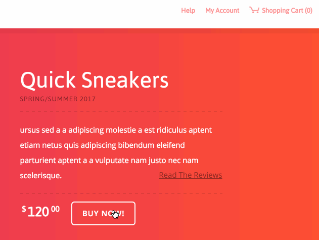
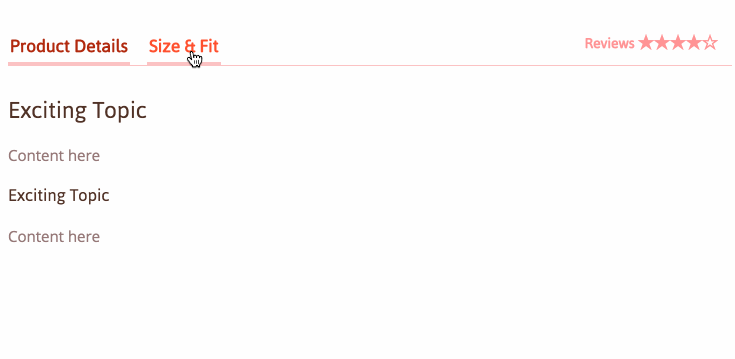

## Lesson 6 Assignment

### Description

The ability to translate a designer's mockup image into a webpage with HTML and CSS is a basic, foundational skill of a professional web developer. This is what you will do over the course of 6 evenings.

In this assignment, you will finish your final project by adding some functionality to what you've already built.

### Details

Use the **[mockup](./images/day-1-mockup.jpg)** you were given on day 1 to add functionality to your website.

There are two pieces of functionality you should add. The first one is **required**, and the second one is a **bonus**.

#### REQUIRED

Each time a user clicks the `BUY NOW!` button:

* The button's text should briefly change to `ADDED TO THE CART!`
* The count of items in the cart - top right of the screen - should increase by one

#### BONUS

* Add tabbed details for `Size & Fit`. Users should be able to toggle between `Product Details` and `Size & Fit`.

### Deliverables

* Push your work to Github
