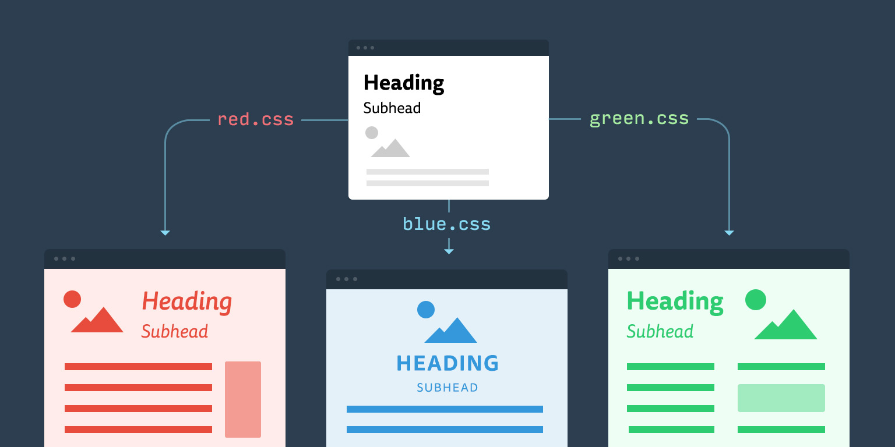
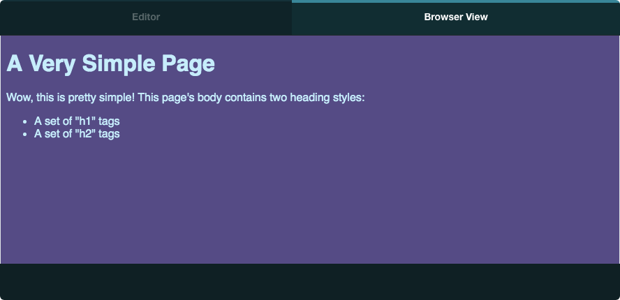
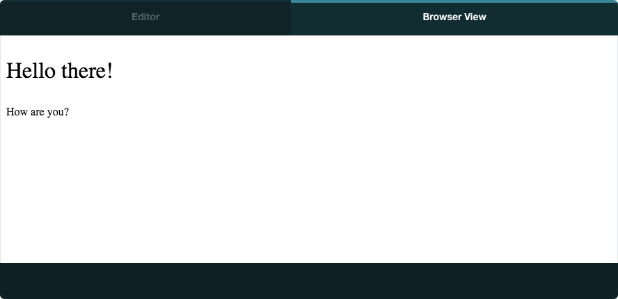

[](#)

## Welcome to Foundations: Front-end Engineering

Each day you'll have **study notes** like this that will include helpful notes, examples, and resources needed to make the most of this course. Today's class will cover setting up your computer and introduce important HTML and CSS concepts.

## Today's Learning Objectives

Today we'll cover these **learning objectives**. By the end of today, you'll be able to

- create a project and view you work in the browser
- navigate through through terminal
- define the term _semantics_
- apply the proper semantic (or non-semantic) tag to a content element
- use tag and class selectors to apply styles to HTML content
- identify the appropriate use of tag and class selectors for styling content

As you attend the lecture and lab, read these notes, and work on your homework, keep these learning objectives top of mind. If you're having difficulty with any of the objectives, make sure to ask questions!

## Resources

- **<a href="https://developer.mozilla.org/en-US/">MDN -Mozilla Developer Network - HTML, CSS, Javascript Documentation</a>**
- **<a href="https://www.w3schools.com/">W3Schools - This site offers helpful explanations and examples</a>**

## Computer Setup

You'll need to install two important tools:

- **<a href="https://www.google.com/chrome/">Google Chrome - a popular browser with excellent developer tools built in</a>**
- **<a href="https://code.visualstudio.com/download">Visual Studio Code (VS Code) - a free, open-source code editor built by Microsoft</a>**
<!-- GitHub Desktop - a well-designed application for managing projects that are version-controlled with Git -->

<!-- You'll also need to sign up for a free GitHub account. Signing up for GitHub and installing these two tools should only take a few minutes, but they'll make a huge difference in your success. -->

## GIT AND GITHUB

GitHub is a popular web-based hosting service for version control which offers features such as pull requests, issue tracking, and project management tools, facilitating seamless collaboration and efficient software development workflows. You'll need to create an account to share your progress.

- **<a href="https://github.com/join">GitHub Sign Up</a>**

GitHub relies on Git, a powerful version control system that aids in tracking changes in computer files and attributing work among multiple contributors. Its basic workflow involves several key commands, including:

- `git clone`: This command is used to create a local copy of a remote repository. By executing this command along with the URL of the repository, developers can easily obtain a local version of the codebase, enabling them to work on the project without directly affecting the original source.
- `git init`: Initializing a local repository is the first step in version controlling a project. This is achieved by navigating to the project directory in the terminal and using the command git init. This sets up all the necessary files and data structures, transforming the current directory into a Git repository.
- `git status`: This command displays the current state of the working directory and the staging area, highlighting which changes are yet to be committed.
- `git add`: By utilizing this command, developers can include file changes in the staging area, preparing them for the next commit.
- `git commit`: This command records the changes made to the files in the repository, creating a new commit
  that encapsulates the current state of the project.
- `git push`: With this command, developers can upload the locally saved commits to a remote repository,
  making the changes accessible to others and enabling collaboration across different locations.

If this seems like a lot, that's okay! You don't need to memorize every detail of this process, but you will want to create a workflow you're comfortable. Both Git and GitHub are industry standards that you'll use multiple times a day, every day as a software engineer.

Let's get some practice in by working through the first two lessons of the [Learn Git Branching](https://learngitbranching.js.org/?locale=en_US) tutorial together. You won't need to install anything to complete these lessons.

- Everyone needs a refresher sometimes. If you're feeling stuck or can't remember which git command to use next, you can refer to this **<a href="https://education.github.com/git-cheat-sheet-education.pdf">Git cheat sheet</a>**.

## Getting Started with HTML

HTML (short for HyperText Markup Language) forms the structure of a web page. If you were to view a document that contained only plain text, it would be difficult to distinguish between titles, headings, paragraphs, lists, etc.

```
A very simple web page
A Very Simple Page
Wow, this is pretty simple!
Wow, this is pretty simple! This page's body contains two heading styles:
A set of "h1" tags
A set of "h2" tags
```

With HTML, the same content is formatted in a way that's readable and meaningful to both humans and browsers.

```
<!DOCTYPE html>
<html>
<head>
  <title>A very simple web page</title>
</head>
<body>
  <h1>A Very Simple Page</h1>
  <p>Wow, this is pretty simple! This page's body contains two heading styles:</p>
  <ul>
    <li>A set of "h1" tags</li>
    <li>A set of "h2" tags</li>
  </ul>
</body>
</html>
```

The code above looks like this when rendered by a browser:

[](#)

## Creating, Editing, and Viewing HTML Files

- Using VS Code, select `File` > `New File` from the top menu. This will create a new, empty editor window.
- Go ahead and save a new file named `index.html`. You can do this via `File` > `Save` in the top menu, `cmd + s` on Mac, and `ctrl + s` on Windows.
- Once you've saved your file with the correct `.html` file extension, VS Code will recognize the file as HTML. If you'd like, insert some boilerplate HTML (more on boilerplate code below). Try typing `html` and pressing tab. It should expand into a snippet that looks similar to this:

```
<!DOCTYPE html>
<html>
  <head>
    <meta charset="utf-8">
    <title></title>
  </head>
  <body>
  </body>
</html>
```

- You'll want to add just a bit of text here, otherwise this basic markup won't render as anything but whitespace. Try adding some text between the `<body></body>` tags, and save your file again.
- Next, find the file you've saved via Finder (on Mac) or Explorer (on Windows), right click on it and select **Open With Chrome**. If everything worked, you should see your text on a very plain looking page. Congrats! Now let's dig in on some syntax.

## Understanding HTML Syntax

### HTML TAGS

In HTML, content is written using **tags**. Tags can be "wrapped" around content, as with a `<p>` tag, where an opening `<p>` is at the beginning of the paragraph and a `</p>` tag is at the end, or tags can be self-closing, such as the `` tag.

[](#)

[](#)

### Boilerplate HTML

A typical HTML document needs a few basic things to work:

- a self-closing `<!DOCTYPE>` tag
- `<html></html>` tags
- `<head></head>` tags
- `<body></body>` tags

[](#)

Make sure you have this "boilerplate" markup handy as you work on HTML projects. Many code editors provide snippets to quickly insert this into a new HTML file.

```
<!DOCTYPE html>
<html>
<head>
  <title></title>
</head>
<body>
</body>
</html>
```

[](#)

### A Few Very Common HTML Elements

Without a doubt, you'll see some HTML elements much more often than others. Some you may never even see in the wild without a long search. Here are a few of the most common elements:

- `<p></p>` is short for "paragraph", and it's the basic container for plain text.
- `<div></div>` is short for "divider" and is the most generic way to wrap a block of content. It's older than most of the content sectioning elements, so div tags were previously used for headers, navigation, sections, etc. Since HTML5 introduced much more semantic tags, we now use divs only when no other element makes sense.
- `<a></a>` is used for links, and it is short for "anchor".
- `<h1></h1>` is short for "Heading 1". The heading elements, `h1` through `h6`, introduce the content that follows them. `h1` is the most important and `h6` is the least important.
- `` is short for "image". It is a self-closing, or "void" tag.

### HTML Attributes

Many of the tags you'll write in HTML will have attributes, and some tags will do almost nothing if they don't have attributes. Attributes are written like this:

[](#)

One of the most common HTML attributes is `class`. You'll often see examples like this:

```
<p class="introduction">This is the introduction.</p>
```

This `introduction` class doesn't do much on its own, but when paired with CSS, as we'll see below, it becomes a powerful tool for styling elements on the page.

### What is "Semantic" HTML?

HTML that uses correct and meaningful tags is generally called **semantic markup**. When a document is "marked up" with the correct HTML tags, browsers can properly render information, correctly display links and buttons, and search engines can better understand the hierarchy and importance of the content.

This also helps improve the browsing experience for users who rely on assistive technology. For example, a user with a visual impairment may rely on a **screen reader** application to create audio descriptions of a page. When proper HTML is written, screen readers can correctly explain a page's content to the listener.

### Examples of Semantic Elements

- `<header></header>` contains the kind of content you often see at the top of a page - a site logo, navigation links, a search form, etc. A page header can also contain a "title" for the page, but in a heading element, such as an `h1`. The `title` element is part of the `head` element; the `header` and headings `h1` through `h6` belong in the `body`.
- `<footer></footer>` typically contains copyright and/or author information about the section, article, or page that encloses it.

## CSS BASICS

As you've seen from the examples we've looked at, plain HTML has very little styling. It does have some styles to help users visually distinguish between headings and other elements, but otherwise its quite plain.

CSS (short for Cascading Style Sheets) allows us to specify general styles to a subset of elements. CSS code generally lives in separate files known as **stylesheets**. This pattern is powerful, in that we can store all of a site's styles in one file, even if the site consists of many pages.

[](#)

Here, we've added a stylesheet to the example from above. Notice the difference!

[](#)

## Creating, Editing, and Viewing CSS Files

- Using VS Code, select `File` > `New File` from the top menu just like we did previously.
- Save the new file and name it `styles.css`. Make absolutely sure that your file is in the same directory as the `index.html` file we created earlier. The `.css` file extension is important!
- Once you've saved your file with the correct `.css` file extension, VS Code will recognize the file as CSS.
- CSS doesn't require boilerplate code like HTML, but you'll still want to add some simple styles just to make sure it works. Let's set the body background to red, so you'll know very quickly if you stylesheet is working. Add this to your file:

```
body {
  background: red;
}
```

- You don't have to open this file in Chrome. Instead, you'll link to it from your HTML, as explained below.

## Linking to an External Stylesheet

To start using the styles from an external stylesheet, a special HTML tag is required. We add a self-closing `<link>` tag inside of the `<head></head>` tags to tell the browser which styles to apply.

```
...
<head>
  <link rel="stylesheet" type="text/css" href="styles.css">
</head>
...
```

If you correctly linked your file, refreshing your `index.html` file Chrome should now display your webpage with a red background.

[](#)

## CSS Syntax

Styling HTML with a CSS **rule** usually involves three things:

- at least one **selector** that specifies which elements to style
- one or more **properties** that specify what to style
- one **value** per property that specifies what the style should be

[](#)

[](#)

## Using CSS selectors

In the above diagram, a `<p>` tag is being styled. Using a tag name as a selector like this effectively states "find all `<p>` tags on the page and set these properties". While this is useful, often times you'll only want to style a subset of a certain element.

For example, to style only some `<p>` tags with larger text, you can add a **class** attribute to the paragraphs you'd like to style in the HTML, and use that class as a selector in the CSS. Take a look at the HTML below:

```
<p class="larger-text">Hello there!</p>
<p>How are you?</p>
```

```
.larger-text {
  font-size: 32px;
}
```

Notice the dot (`.`) before larger-text in the CSS? This small distinction is important because **CSS uses a preceding dot to distinguish between tag names and class names**.

Here's a rendered example:

[](#)

## Common CSS Properties

- `color` is used to set text color. Values are usually written in hex format
- `background-color` is used to set background color. Values are usually written in hex format
- `font-size` sets the size of the text inside of the selected elements. Values are numeric, and require a unit of measurement, such as `20px` (pixels) or `3em` (ems).
- `text-decoration` is typically used to make text look underlined. `<a>` text has a `text-decoration` value of `underline` by default
- `height` is used to explicitly set the height of a block-level element (but won't work on inline elements). Values are numeric but require a unit of measurement, usually as pixels (`px`) or percentage (`%`)
- `width` follows the same rules as height, but for width of elements from left to right
