[](#)

Today's class will dig into how the `display` property works.

## Today's Learning Objectives

Today we'll cover these **learning objectives**. By the end of today, you'll be able to:

* *explain the `display` property and how it affects an element's role in the layout*
* *use the display properties to arrange page elements into a column layout*

As you attend the lecture and lab, read these notes, and work on your homework, keep these learning objectives top of mind. If you're having difficulty with any of the objectives, make sure to ask questions!

## The 'display' property

For people new to CSS, the `display` property can be easy to misunderstand. In fact, quite a few people end up using it for years without fully understanding how it works or when to use it. Since it's so commonly misunderstood, let's dig in.

The CSS specification states that the `display` property defines, among other things, how an HTML element participates in the parent formatting context. In other words, it defines the element's role in the layout. There are two primary roles: `block` (meaning it occupies the entire horizontal space) and `inline` (meaning it occupies a portion of the horizontal space equal to the width needed to fit the inner content).

[](#)

### Display Block

When using `display: block`, the element will start on a new line and occupy the full width of the parent container. You can, however, override the `width` with anything you want. Display block is the default display value for `header`, `section`, `div`, and `p` elements, as well as all header elements, `h1` to `h6`. Using block means the element won't sit side by side with other elements, rather it forces other elements to a new line, either above or below itself.

[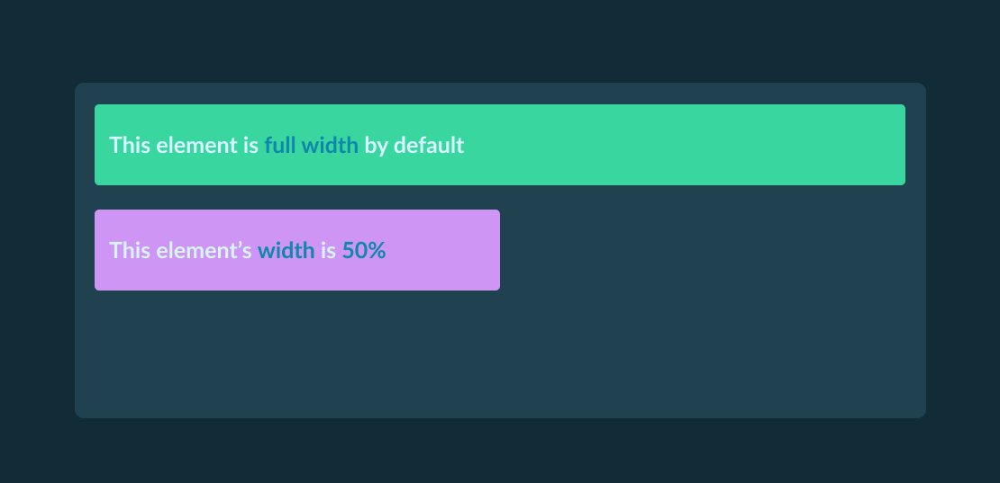](#)

### Display Inline

When using `display: inline`, the element will occupy only the required amount of space to present all of its content. Unlike `display: block`, other content can be placed before or after it horizontally without pushing it to a new line. Inline elements however cannot have an explicitly defined `width` or `height` property. This is the default display value for elements like `span` and `a`.

[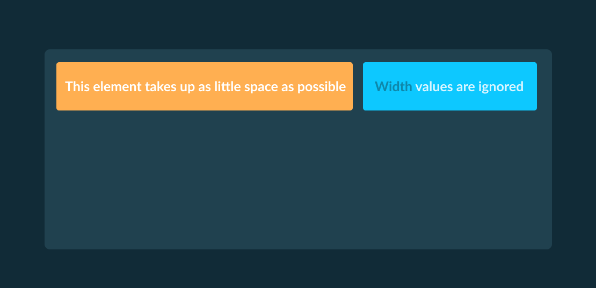](#)

### Mixing Inline and Block Elements

It's common for web pages to contain a mixture of both block and inline elements. When this occurs, the same rules apply: `display: block` elements will take up the full width of the parent container and sit alone in that horizontal space, even if there are `display: inline` elements after or before it that could "fit".

[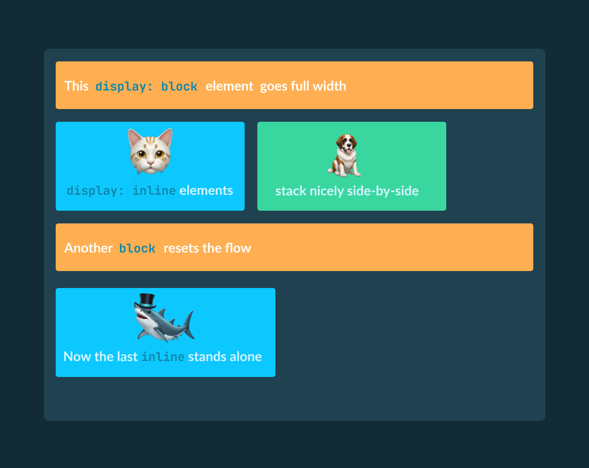](#)

### Display Inline-Block

Now that you know about `display: block` and `display: inline`, you might be wondering how you could put elements next to each other horizontally and specify their width. The solution is `display: inline-block`.

The inline-block display is a useful hybrid of the block and inline display types which allows for `width` and `height` to be specified. But unlike the normal block type, inline-block allows other elements to appear before or after it horizontally. This is the default display value for elements like `button` and `select`, but it can also be applied to any other element.

If we take the inline example from above and change it to inline-block, there's a big difference in the way its rendered.

[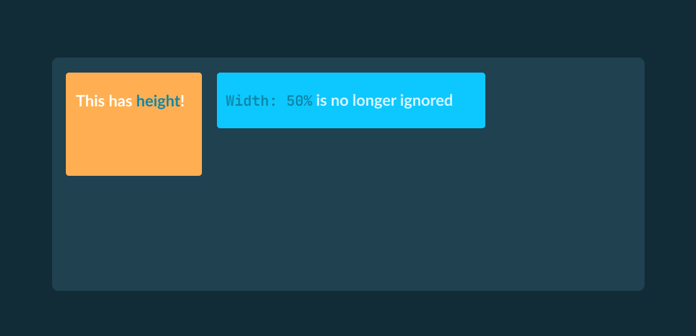](#)

[](#)

### Display Flex

`display: flex` is a powerful tool for creating layouts. It allows you to easily arrange elements in a row or column, and even specify how much space each element should take up. 

**Flex Items**

The children of a flex container are called flex items. Flex items can be arranged in two ways: horizontally or vertically. The default is horizontal, but you can change this by setting the `flex-direction` property.

[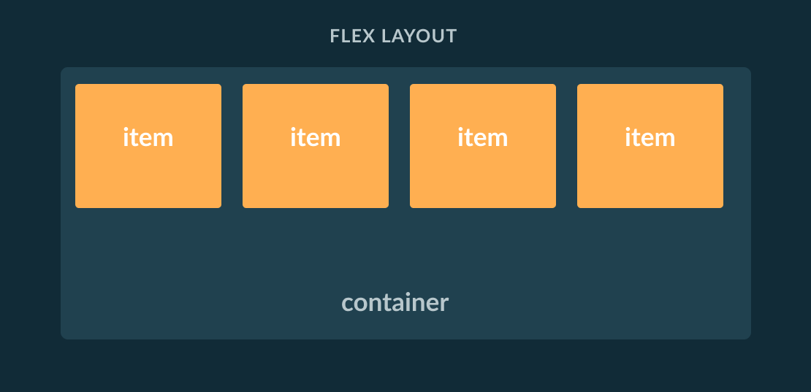](#)

**Flex Direction**

`flex-direction` controls the direction in which flex items are arranged. The default value is `row`, which arranges items horizontally. Other values include `column`, which arranges items vertically, `row-reverse`, which arranges items horizontally in reverse order, and `column-reverse`, which arranges items vertically in reverse order.

[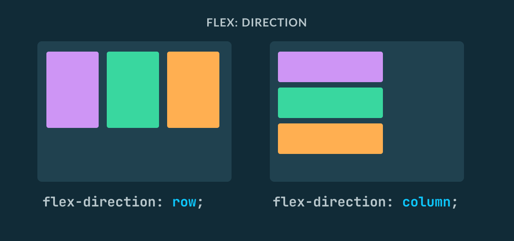](#)

**Main and Cross Axes**

`display: flex` is based on the 2 axes: the main axis and the cross axis. The main axis is the axis that runs from left to right in a horizontal layout (`flex-direction: row`), or from top to bottom in a vertical layout (`flex-direction: column`). The cross axis is the axis that runs from top to bottom in a horizontal layout, or from left to right in a vertical layout.

[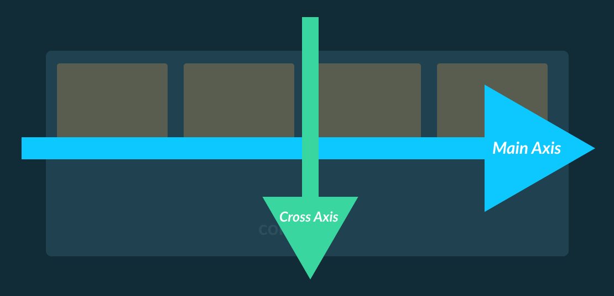](#)

**Justify-Content**

`justify-content` controls how flex items are aligned along the main axis. The default value is `flex-start`, which aligns items to the start of the main axis. Other values include `flex-end`, `center`, `space-between`, and `space-around`.

[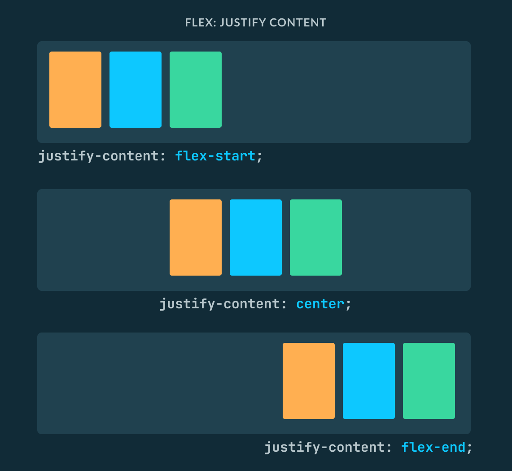](#)

**Align-Items**

`align-items` controls how flex items are aligned along the cross axis. The default value is `stretch`, which stretches items to fill the container. Other values include `flex-start`, `flex-end`, `center`, and `baseline`.

[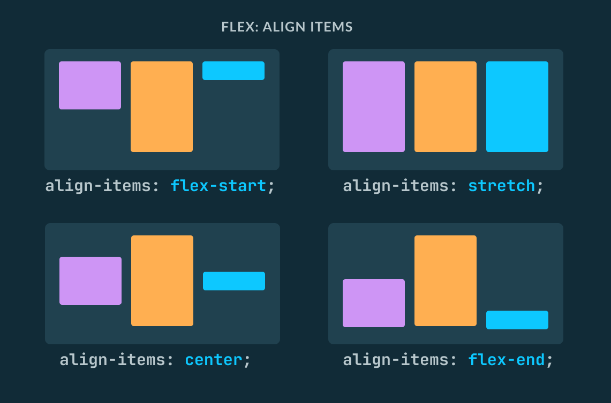](#)
**Align-Content**

`align-content` controls how flex items are aligned along the cross axis when there is extra space in the container. The default value is `stretch`, which stretches items to fill the container. Other values include `flex-start`, `flex-end`, `center`, `space-between`, and `space-around`.

[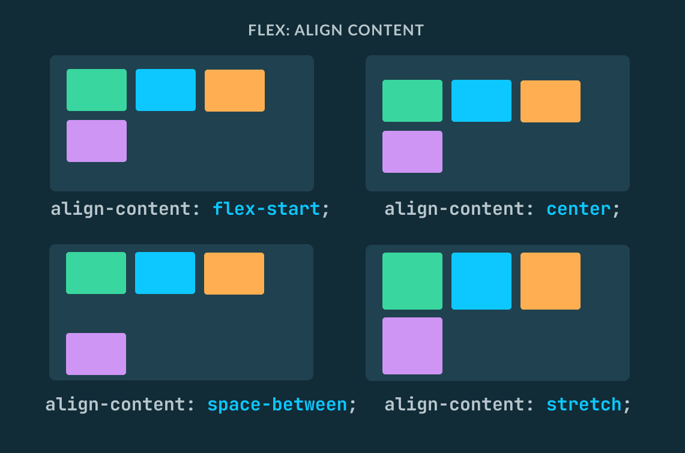](#)

**Let's Flex!**

Here's an example of what the CSS for a `flex` container might look like. Try to picture the layout this CSS will produce before testing it yourself.
```
.container {
    display: flex;
    flex-direction: column;
    align-items: center;
    justify-content: space-between;
}

.item {
    /* styles for the flex items */
}

```

For more `flex` practice, let's play a game. Check out  **<a href="https://flexboxfroggy.com/">Flexbox Froggy</a>** 🐸!

### Display None

So far we've talked about displaying elements. But what about hiding elements? When using `display: none`, the element will not be visible and will not occupy space in the layout. Note that there is also a `visibility` property that can hide elements, but those elements will still occupy space in the layout. The `display: none` property is useful in combination with JavaScript to make certain elements show or hide depending on the state of the application (hiding a menu until the "menu" button is clicked, for example). This is the default display value for elements like `script` and `meta`.

[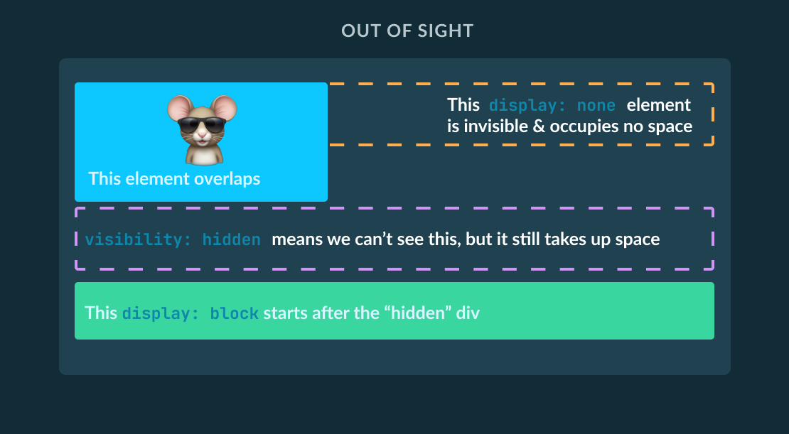](#)

